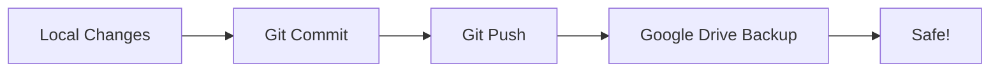

# Google Drive Synchronization Guide

## Overview

The Spectrum Protocol 2026 includes full rclone integration for synchronizing your agentEther project with Google Drive. This provides automatic backup, cross-device sync, and disaster recovery capabilities.

## Features

✅ **Automatic Backup** - One command to backup entire project
✅ **Bidirectional Sync** - Keep Google Drive and local in sync
✅ **Smart Filtering** - Excludes secrets, logs, and large files
✅ **Environment Support** - Works with SWISSAI and Anthropic Cloud
✅ **Disaster Recovery** - Full project restore from Google Drive
✅ **Differential Sync** - Only transfers changed files

---

## Quick Start

### 1. Install rclone

```bash
# Linux/macOS
curl https://rclone.org/install.sh | sudo bash

# Verify installation
rclone version
```

### 2. Configure Google Drive Remote

```bash
# Interactive configuration
rclone config

# Follow prompts:
# - Choose: n (New remote)
# - Name: agentether-gdrive
# - Type: drive (Google Drive)
# - Complete OAuth flow
```

**Or copy template:**

```bash
# Copy template to rclone config
mkdir -p ~/.config/rclone
cp .rclone.conf.template ~/.config/rclone/rclone.conf

# Edit with your credentials
nano ~/.config/rclone/rclone.conf
```

### 3. Test Connection

```bash
# List remotes
rclone listremotes

# Should show:
# agentether-gdrive:

# Create project folder on Google Drive
rclone mkdir agentether-gdrive:agentEther

# Test listing
rclone lsd agentether-gdrive:
```

### 4. First Backup

```bash
# Preview what will be backed up
./sync-gdrive.sh backup --dry-run

# Perform actual backup
./sync-gdrive.sh backup
```

---

## Available Commands

### Backup to Google Drive

```bash
# Standard backup
./sync-gdrive.sh backup

# Preview backup (no changes)
./sync-gdrive.sh backup --dry-run

# Backup with detailed output
./sync-gdrive.sh backup --verbose

# Force backup without confirmation
./sync-gdrive.sh backup --force
```

### Restore from Google Drive

```bash
# Preview restore
./sync-gdrive.sh restore --dry-run

# Restore with confirmation prompt
./sync-gdrive.sh restore

# Force restore (DANGEROUS!)
./sync-gdrive.sh restore --force
```

⚠️ **Warning:** Restore will OVERWRITE local files!

### Bidirectional Sync

```bash
# Sync changes in both directions
./sync-gdrive.sh sync

# Preview sync
./sync-gdrive.sh sync --dry-run
```

This will:
- Upload local changes to Google Drive
- Download Google Drive changes to local
- Resolve conflicts (newer wins)

### Check Status

```bash
# Show differences between local and Google Drive
./sync-gdrive.sh status
```

Shows:
- Files only in local
- Files only on Google Drive
- Size comparison

### List Remote Files

```bash
# Show all files on Google Drive
./sync-gdrive.sh list
```

### Check Configuration

```bash
# Verify rclone setup
./sync-gdrive.sh check
```

### Storage Usage

```bash
# Show size analysis
./sync-gdrive.sh size
```

---

## What Gets Synced?

### ✅ Synced to Google Drive

- Source code (`.js`, `.py`, `.sh`, etc.)
- Configuration templates (`.env.example`, `.env.template`)
- Docker files (`Dockerfile`, `docker-compose.yml`)
- Environment configs (`environments/`)
- Documentation (`.md` files)
- Scripts (`switch-env.sh`, `sync-gdrive.sh`)
- Directory structure (`.gitkeep` files)

### ❌ Excluded from Sync

See `.rcloneignore` for full list:

- **Secrets:** `.env`, `*.key`, `*.pem`, credentials
- **Git:** `.git/` directory
- **Logs:** `*.log`, large log files
- **Dependencies:** `node_modules/`, `.npm/`
- **Runtime:** Docker override files, caches
- **OS Files:** `.DS_Store`, `Thumbs.db`
- **Large Data:** `chromadb-memory/`, `*.db`

---

## Workflow Examples

### Daily Development Workflow

```bash
# Morning: Start work
git pull origin claude/fix-kernel-stability-1oIFj
./sync-gdrive.sh restore --dry-run  # Check if anything changed

# During day: Make changes
# ... edit files ...

# Evening: Backup work
git add .
git commit -m "Add new feature"
git push origin claude/fix-kernel-stability-1oIFj
./sync-gdrive.sh backup
```

### Multi-Device Workflow

**On Device A (SWISSAI):**

```bash
# Make changes
./switch-env.sh swissai
# ... edit files ...

# Commit to Git
git add .
git commit -m "Update configuration"
git push origin claude/fix-kernel-stability-1oIFj

# Backup to Google Drive
./sync-gdrive.sh backup
```

**On Device B (Anthropic Cloud):**

```bash
# Sync from Git
git pull origin claude/fix-kernel-stability-1oIFj

# Check Google Drive differences
./sync-gdrive.sh status

# Restore if needed
./sync-gdrive.sh restore

# Apply environment
./switch-env.sh anthropic
```

### Disaster Recovery

**If you lose local files:**

```bash
# 1. Clone repository
git clone <repo-url>
cd agentEther

# 2. Configure rclone (if on new machine)
rclone config

# 3. Check what's on Google Drive
./sync-gdrive.sh list

# 4. Restore everything
./sync-gdrive.sh restore

# 5. Restore credentials (manual)
# Edit .env with your API keys
nano .env

# 6. Verify
docker-compose config
```

---

## Integration with Git

### Git + Google Drive Strategy

**Use Git for:**
- Code and configuration files
- Version history
- Collaboration

**Use Google Drive for:**
- Additional backup layer
- Large files (if needed)
- Cross-device sync of non-git files

### Recommended Workflow



1. **Edit** files locally
2. **Commit** to Git (version control)
3. **Push** to GitHub (collaboration)
4. **Backup** to Google Drive (safety net)

---

## Automated Backup

### Cron Job (Linux/macOS)

Add to crontab:

```bash
# Edit crontab
crontab -e

# Add line (backup every day at 2 AM):
0 2 * * * cd /path/to/agentEther && ./sync-gdrive.sh backup --force >> logs/gdrive-sync.log 2>&1
```

### Git Hook (Automatic)

Create `.git/hooks/post-push`:

```bash
#!/bin/bash
# Automatically backup to Google Drive after git push

echo "Backing up to Google Drive..."
./sync-gdrive.sh backup --force
echo "Backup complete!"
```

Make it executable:

```bash
chmod +x .git/hooks/post-push
```

Now every `git push` will also backup to Google Drive!

---

## Troubleshooting

### Issue: "Remote not configured"

**Solution:**

```bash
rclone config
# Configure agentether-gdrive remote
```

### Issue: "Access denied" or OAuth errors

**Solution:**

```bash
# Reconfigure with new OAuth token
rclone config reconnect agentether-gdrive:
```

### Issue: "Duplicate files" or conflicts

**Solution:**

```bash
# Check status
./sync-gdrive.sh status

# Force sync (local wins)
rclone sync . agentether-gdrive:agentEther --exclude-from .rcloneignore

# Force sync (remote wins)
rclone sync agentether-gdrive:agentEther . --exclude-from .rcloneignore
```

### Issue: Sync is very slow

**Solutions:**

```bash
# Use faster sync with checksums
rclone sync . agentether-gdrive:agentEther --fast-list --checkers 8 --transfers 4

# Skip unchanged files
rclone sync . agentether-gdrive:agentEther --size-only
```

### Issue: Files not being excluded

**Solution:**

```bash
# Check .rcloneignore syntax
cat .rcloneignore

# Test with dry-run
./sync-gdrive.sh backup --dry-run

# Manual sync with exclusions
rclone sync . agentether-gdrive:agentEther --exclude-from .rcloneignore -v
```

---

## Security Best Practices

### ✅ DO:

1. **Always exclude secrets**
   - `.env` files are in `.rcloneignore`
   - Double-check before backing up

2. **Use service accounts for automation**
   ```bash
   # Create service account in Google Cloud Console
   # Download JSON key
   # Configure in rclone
   ```

3. **Enable encryption for sensitive data**
   ```bash
   rclone config  # Choose 'crypt' type
   # Encrypt specific folders
   ```

4. **Regular backups**
   - Daily automated backups
   - Before major changes

### ❌ DON'T:

1. **Never commit rclone.conf to Git**
   - Contains OAuth tokens
   - Already in `.gitignore`

2. **Never backup production secrets**
   - API keys
   - Passwords
   - Certificates

3. **Don't sync node_modules**
   - Use `npm install` instead
   - Already excluded

---

## Advanced Usage

### Sync Specific Directories

```bash
# Backup only environments
rclone sync environments/ agentether-gdrive:agentEther/environments/ --exclude-from .rcloneignore

# Backup only config
rclone sync config/ agentether-gdrive:agentEther/config/ --exclude-from .rcloneignore
```

### Encrypted Backup

```bash
# Set up encrypted remote
rclone config
# Type: crypt
# Remote: agentether-gdrive:agentEther
# Password: <your-password>

# Sync to encrypted remote
rclone sync . agentether-crypt: --exclude-from .rcloneignore
```

### Bandwidth Limiting

```bash
# Limit upload speed to 1 MB/s
./sync-gdrive.sh backup --bwlimit 1M

# Or directly with rclone
rclone sync . agentether-gdrive:agentEther --bwlimit 1M
```

### Exclude Additional Files

Edit `.rcloneignore` and add:

```
# Custom exclusions
*.tmp
test_data/
scratch/
```

---

## Environment-Specific Sync

### SWISSAI Environment

```bash
# Switch to SWISSAI
./switch-env.sh swissai

# Backup SWISSAI-specific config
./sync-gdrive.sh backup
```

### Anthropic Cloud Environment

```bash
# Switch to Anthropic
./switch-env.sh anthropic

# Backup Anthropic-specific config
./sync-gdrive.sh backup
```

### Both environments share the same Google Drive folder but use Git for environment-specific configurations.

---

## Monitoring and Logs

### View Sync Logs

```bash
# Real-time log
tail -f logs/gdrive-sync.log

# Recent syncs
tail -50 logs/gdrive-sync.log

# Search for errors
grep ERROR logs/gdrive-sync.log
```

### Check Last Sync Time

```bash
# On Google Drive
rclone lsl agentether-gdrive:agentEther | head

# Local
ls -lt
```

---

## Support

For issues or questions:

1. Check this documentation
2. Review `.rcloneignore` exclusions
3. Test with `--dry-run` first
4. Check logs: `logs/gdrive-sync.log`
5. Consult rclone docs: https://rclone.org/docs/

---

**Spectrum Protocol 2026** - Google Drive Sync Integration
*Secure, automated, and reliable project backup*
